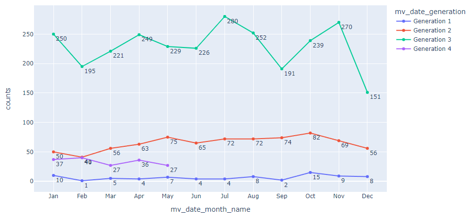

# Exploratory Data Analysis (K-Pop Database)

## Overview
A high level exploration into a K-Pop Database between 1992 and 2020 using Pandas and Plotly.
* [Notebook](https://colab.research.google.com/drive/16m3tS7pwgNO-Ho16ckap1bg7MthjZbab)
